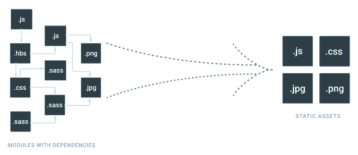
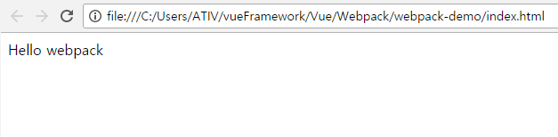

#### What is Webpack?
* application에서 JavaScript 모듈 번들러(Bundler)이다.
* webpack은 application의 의존성 그래프를 빠르게 구성하여 그것들을 순서대로 번들링함으로써 작업흐름을 간단히해준다.
  * 번들링이란?
  
  별도의 파일로 분리되어 있는 JavaScript 모듈들을 의존성을 통해 하나 혹은 여러 개의 파일로 묶는다. (다른 번들러로는 browserify, rollup.js 등이 있다.)

* feature
  * 하나의 파일로 js 파일을 번들
  * ES6/ES7 자바스크립트 코드 작성(Babel)
  * 코드 최적화
  * 생산성을 위해 vendor/css/js 코드 분리
  * 페이지 새로고침과 많은 멋진 기능 없이 코드를 hot-reload하는 개발 서버를 실행
  * 컴파일이 매우 빠름

#### creating a bundle
* webpack은 Node.js가 설치된 환경에서 실행된다.
`mkdir webpack-demo && cd webpack-demo`<br>
`npm init -y`<br>
`npm install --save-dev webpack`
* app/index.js
  ```javascript
  function component() {
    var element = document.createElement('div');

    element.innerHTML = _.join(['Hello', 'webpack'], ' ');
    return element;
  }
  document.body.appendChild(component());
  ```
* index.html
  ```html
  <html>
    <head>
      <title>webpack 2 demo</title>
      <script src="https://unpkg.com/lodash@4.16.6"></script>
    </head>
    <body>
      <script src="app/index.js"></script>
    </body>
  </html>
  ```
* 다음 예시에는 ``` <script> ``` 태그간의 명백한 의존성이 존재한다.
  * index.js는 실행되기 전에 페이지에 포함되는 lodash에 의존적이다.
  * index.js는 lodash에 대한 필요성을 결코 선언하지 않았다.
* 이러한 방식으로 JavaScript 프로젝트를 관리하면 문제가 있다.
  * 만약 의존성이 빠졌거나 잘못된 순서에 포함되어있다면, application은 전혀 기능하지 않는다.
  * 만약 의존성이 포함되었지만 사용되지 않는다면, 브라우저가 다운로드해아하는 많은 필요하지 않은 코드가 있다.
* lodash 의존성을 index.js와 묶으려면 먼저 lodash를 설치해야 한다.
  ```
  npm install --save lodash
  ```
  * app/index.js
    ```javascript
    import _ from 'lodash';
    ```
  * index.html
    ```html
    <html>
      <head>
        <title>webpack 2 demo</title>
      </head>
      <body>
        <script src="dist/bundle.js"></script>
      </body>
    </html>
    ```
    여기서 index.js는 lodash를 명시적으로 선언하며 그것을 _ 에 바인딩한다.
* 모듈이 필요로하는 종속성을 설명함으로써 webpack은 이 정보를 사용하여 종속성 그래프를 만들 수 있다.
* 그런 다음 그래프를 사용하여 스크립트가 올바른 순서로 실행되는 최적화 된 번들을 생성한다. 또한 사용되지 않는 종속성은 번틀에 포함되지 않는다.

* 이제 이 폴더에서 index.js 파일을 입력파일로 사용하고 bundle.js 파일을 페이지에 필요한 모든 코드가 묶여진(bundled) 출력파일로 사용하여 webpack을 실행시킨다.

  ```
  webpack {entry file경로} {bundle file경로}
  webpack app/index.js dist/bundle.js
  ```
  * entry file: 서로 의존 관계에 있는 다양한 모듈을 사용하는 시작점이 되는 파일
  * bundle file: 브라우저에서 실행할 수 있게 모듈을 컴파일한 파일
  ```
  Hash: d59c490051abb2f18aa1
  Version: webpack 2.6.1
  Time: 942ms
    Asset    Size  Chunks                    Chunk Names
    bundle.js  544 kB       0  [emitted]  [big]  main
   [0] ./~/lodash/lodash.js 540 kB {0} [built]
   [1] ./app/index.js 222 bytes {0} [built]
   [2] (webpack)/buildin/global.js 509 bytes {0} [built]
   [3] (webpack)/buildin/module.js 517 bytes {0} [built]
  ```
* index.html을 열고 결과를 확인한다.
  

#### Using ES2015 modules with webpack
* import / export 구문이 브라우저에서 지원되지 않지만, webpack이 그러한 명령어를 ES5 호환 wrapper 코드를 대체할 것이기 때문에 ES2015 module import를 사용할 수 있다.
* webpack은 import / export 외에는 코드를 건들지 않을 것이다.
* ES2015의 다른 기능을 사용하는 경우에는 Babel이나 Buble 같은 transpiler을 사용해야 한다.

#### Using webpack with a config
* 더욱 복잡한 구성을 위해, webpack이 code를 bundle하기 위해 참조할 수 있는 configuration file을 사용할 수 있다.
* **CLI만 이용해서 webpack을 사용할 수도 있지만 명령어가 금방 복잡해지고 한계가 생기므로 설정파일을 사용하는 것이 일반적이다.(엔트리 파일이 많거나 옵션이 많은 경우)**
* webpack.config.js
```javascript
var path = require('path');

module.exports = {
  // 엔트리 파일 목록
  entry: './app/index.js',
  output: {
    // 번들 파일 이름 규칙
    filename: 'bundle.js',
    // 번들 파일 폴더
    path: path.resolve(__dirname, 'dist')
  }
};
```
```webpack --config webpack.config.js```
```
webpack // 컴파일 실행
webpack --watch // 변경사항 자동 반영
```
```
Hash: d59c490051abb2f18aa1
Version: webpack 2.6.1
Time: 645ms
    Asset    Size  Chunks                    Chunk Names
bundle.js  544 kB       0  [emitted]  [big]  main
   [0] ./~/lodash/lodash.js 540 kB {0} [built]
   [1] ./app/index.js 222 bytes {0} [built]
   [2] (webpack)/buildin/global.js 509 bytes {0} [built]
   [3] (webpack)/buildin/module.js 517 bytes {0} [built]
```

#### Using webpack with npm
